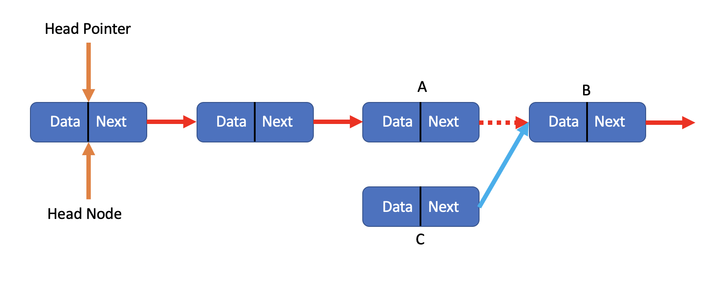
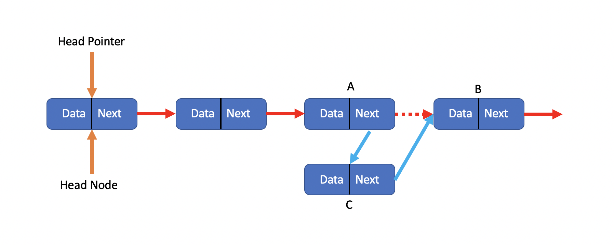
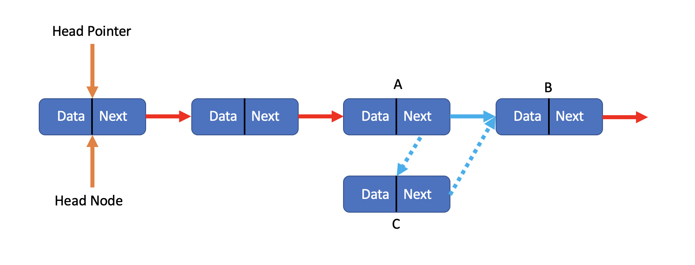
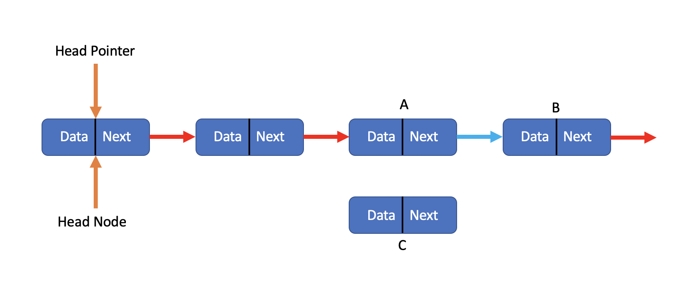
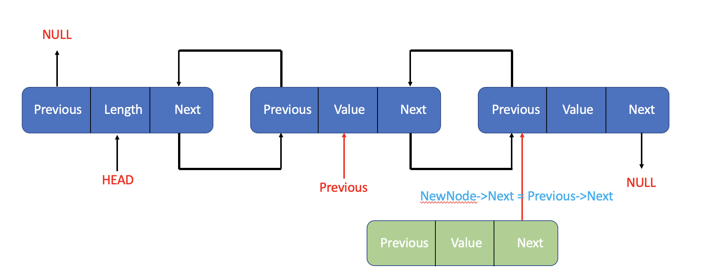
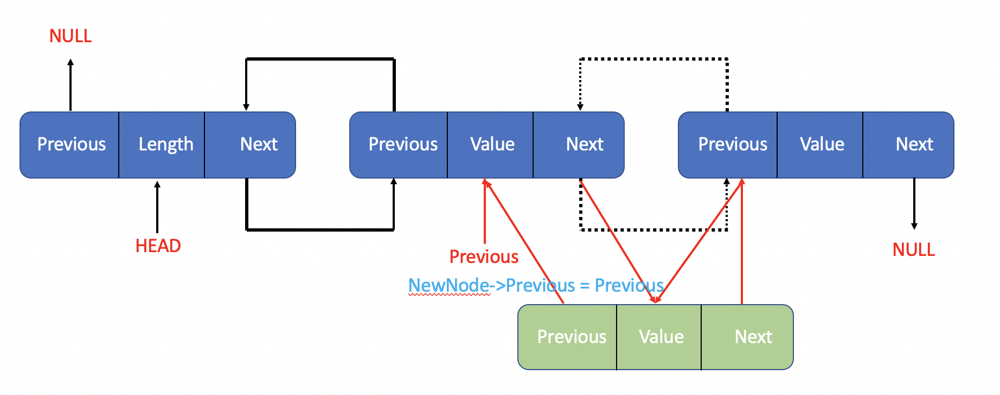
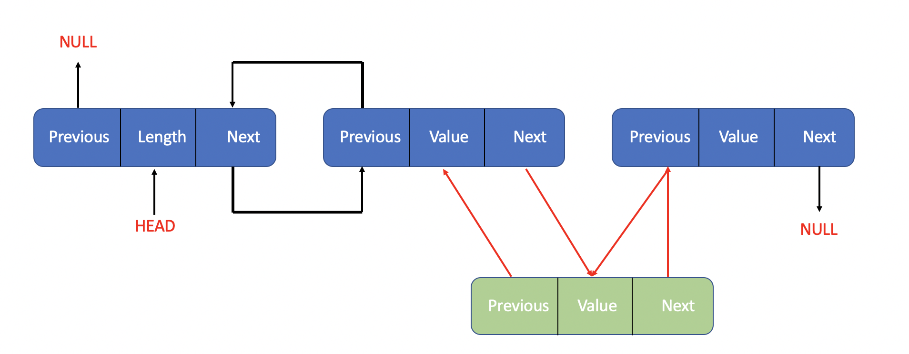
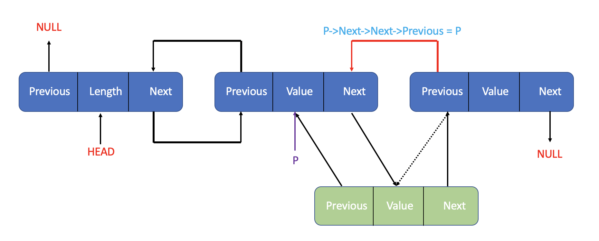

## Contents
- [LinkedList](#LinkedList)
- [Doubly LinkedList](#Doubly-LinkedList)

### LinkedList

- [Operations](#linkedlist_operations)
	- [Insert](#linkedlist_insert)
	- [Delete](#linkedlist_delete)
	- [Conclusion](#linkedlist_conclusion)

Here is the linked list. It looks like this.

> In order to avoid the linear cost of insertion and deletion, we need to ensure that the list is not stored contiguously. By using this kind of list, we can make the cost of insertion and deletion be O(1).
The linked list consists of a series of structures, which are not necessarily adjacent in memory.
Each node contains the element and a pointer points to the next node, we call it Next pointer, And the last node's Next pointer points to NULL. And ANSI C specifies that NULL is zero.

In my version, I put a head node to save the length of the linked list.

Now we can see the operations of LinkedList.

<h4 id="linkedlist_operations">Operations</h4>

<h5 id="linkedlist_insert">Insert</h5>

It's the first step of the insert operation.

As we can see, we got Node A, B, C, and the C is the newest node we wanna insert into this list. First we make the Next pointer of C equals Next pointer of A, then the C node's Next Pointer points to node B.

second step, we let the A's Next pointer points to our new node C.

Finally, we finished it.

***Insert Successed!!***

<h5 id="linkedlist_delete">Delete</h5>

We'll show two steps of delete operation.

First step, we let the node A's Next pointer equals the Next pointer of node C.

Second step, because we just get one Next pointer for each node, so, it just make no pointer points to node C.

**So delete Successed!!**

<h5 id="linkedlist_conclusion">Conclusion</h5>

We know that if you just calculate the cost of insertion or deletion, you'll find T(n) = O(1).
But you know if we wanna insert or delete a value with speicify index, it'll cost O(n) in whole operation. But the cost of insertion or deletion still is O(1). Here, we just talk aboult the cost of insertion or deleteion.

### Doubly LinkedList

- [Operations](#doublylinkedlist_operations)
	- [Insert](#doublylinkedlist_insert)
	- [Delete](#doublylinkedlist_delete)
	- [Conclusion](#doublylinkedlist_conclusion)

Sometimes it's convenient to traverse lists backwards. We just add an extra field to the data structure, containing a pointer to the previous node.

Here is what Doubly LinkedList looks like.

In my version, there's still has a head node of the list, and it's value equals the total number of valid nodes.

Now we can see the basic operations of doubly linkedlist.

<h4 id="doublylinkedlist_operations">Operations</h4>

<h5 id="doublylinkedlist_insert">Insert</h5>

First Step, we get a new node called NewNode, and get it ready for insertion. Then we let the Next Pointer of NewNode equals the Next pointer of previous node.

Then we need to let the Previous pointer of the node that the Next pointer of previous node points to points to the NewNode.

Let the Next pointer of Previous node points to NewNode

Now we can let the Previous pointer of NewNode points to the Previous node.

**And then we finished the insertion. Insert at the end of the list is similar to this.**

<h5 id="doublylinkedlist_delete">Delete</h5>

First, we call the node we want to delete TargetNode.

As the picture shows, we should let the previous pointer of the next node of the TargetNode points to the previous node of the TargetNode.

Then we let the Next pointer of previous node points to the next node of the TargetNode.

**Finished!! Just don't forget to free the space of TargetNode.**

<h5 id="doublylinkedlist_conclusion">Conclusion</h5>

The cost of insertion or deletion still O(1).
It's just as same as [linkedlist](#LinkedList) -- The standard implementation.